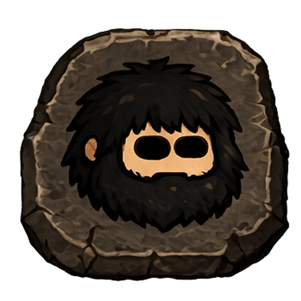

<div align="center">



# Ogg Desktop — The OGG Master Tool

### Stake · Send · Govern — the official desktop wallet for Oggchain

The first-generation desktop Master Tool for **Oggcoin (OGG)** on **Oggchain**.
One app to hold your OGG, stake it, claim rewards, fund the Tribe, and vote on-chain.


</div>

---

## ⛏️ What is this?

**Ogg Desktop** is the official native wallet for the Oggchain network (Chain ID **70088**). It's a self-custody wallet — your keys live encrypted on your own machine and never leave it. Everything the chain offers is built into one clean interface: no browser extensions, no third-party custody, no command line required.

> *Rock turns into digital copper. Tribe strong. Mine. Stake. Build. Repeat.*

---

## ✨ Features

| | |
|---|---|
| 👛 **Wallet** | Create a new wallet, import an existing one (private key or keystore), view balance and full transaction history |
| 💸 **Send & Receive** | Send OGG with live gas estimation, receive to your address with one-click copy |
| ⭐ **Staking** | Stake and unstake OGG, track your position, watch your cooldown timer, and claim rewards |
| 🏛️ **Tribe Pool** | View the treasury and contribute to the Tribe |
| 🗳️ **Governance** | Create proposals, vote yes/no, and finalize after the voting period |
| 🔍 **Explorer** | Jump straight to contracts and transactions on the Oggchain explorer |
| 🔒 **Self-custody** | Keys are encrypted locally with your password — nothing is ever uploaded |
| 🌙 **Light & dark** | A warm cave-lit theme, your choice of light or dark |

---

## 📥 Download & Install

Grab the latest build for your system from the [**Releases**](../../releases) page.

| OS | File | How to run |
|----|------|------------|
| **Windows** | `Ogg Desktop Setup 1.0.0.exe` | Double-click and install. Adds a Start-menu & desktop shortcut. |
| **macOS** | `Ogg Desktop-1.0.0.dmg` | Open the `.dmg`, drag **Ogg Desktop** into **Applications**. |
| **Linux** | `Ogg Desktop-1.0.0.AppImage` | `chmod +x` it, then run. No install needed. |

> **First launch on macOS:** the app is currently unsigned, so macOS may say it's from an "unidentified developer." Right-click the app → **Open** → **Open**, or allow it under **System Settings → Privacy & Security**. This is expected and one-time.

---

## 🌐 Network

| | |
|---|---|
| **Chain** | Oggchain |
| **Coin** | Oggcoin (OGG) |
| **Chain ID** | `70088` |
| **RPC** | `https://rpc.oggcoin.org` |
| **Explorer** | `https://scan.oggcoin.org` |
| **Consensus** | ProgPoW (hybrid PoW / PoS) |

### Core contracts

| Contract | Address |
|----------|---------|
| Staking  | `0xa47008c59f729756bEc7d01f6FE71328A242d0c4` |
| Tribe Pool | `0x085CF5da09842FA3BA01068CC02c156198b1b114` |
| Vesting  | `0x1B24BD66921f821fF034285A8528EB31F12bFF66` |

---

## 🛠️ Build from source

The wallet is built with [Electron](https://www.electronjs.org/) and [ethers.js](https://docs.ethers.org/v5/). You need **Node.js 18+** (Node 20 recommended).

```bash
# clone
git clone https://github.com/Oggcoin/Ogg-Desktop.git
cd Ogg-Desktop

# install dependencies
npm install

# run in development
npm start
```

### Packaging

Build a distributable for your platform (output lands in `dist/`):

```bash
npm run build:win      # Windows  → Setup .exe + portable .zip
npm run build:linux    # Linux    → .AppImage + .zip
npm run build:mac      # macOS    → .dmg  (must be run on a Mac)
```

> macOS builds can only be produced on macOS. On a fresh Mac you'll first need Xcode Command Line Tools (`xcode-select --install`), [Homebrew](https://brew.sh), and Node (`brew install node@20`).

---

## 🧱 Project structure

```
Ogg-Desktop/
├── assets/            # app icons (.ico, .icns, .png) + installer art
├── src/
│   ├── main.js        # Electron main process (window, tray, RPC bridge)
│   ├── preload.js     # secure bridge to the renderer
│   ├── index.html     # the wallet UI
│   ├── wallet.js      # key generation, encryption, signing
│   └── lib/           # bundled ethers.js
├── package.json       # app + build configuration
└── README.md
```

---

## 🔐 Security

- **Self-custody.** Your private keys are encrypted with your password and stored only on your device. They are never transmitted anywhere.
- **Back up your keys.** If you lose your password or your device, no one — including the Oggchain team — can recover your wallet. Export and safely store your private key or keystore.
- **Verify your download.** Only install builds from the official [Releases](../../releases) page.
- Found a vulnerability? Please report it responsibly rather than opening a public issue.

---

## 🗺️ Roadmap

This is **v1.0.0** — the first desktop Master Tool to ship on Oggchain.

---

## 🤝 Contributing

Issues and pull requests are welcome. If you're building on Oggchain or want to improve the wallet, open an issue to start the conversation.

---

## 📜 License

Released under the [MIT License](LICENSE).

<div align="center">

**Tribe strong. Mine. Stake. Build. Repeat.** 🦣

*Oggchain · Chain ID 70088*

</div>
