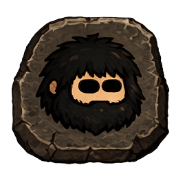
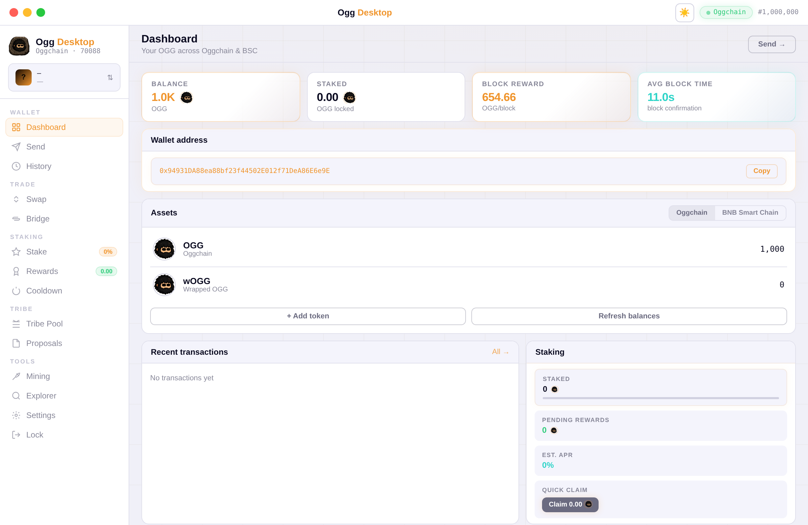
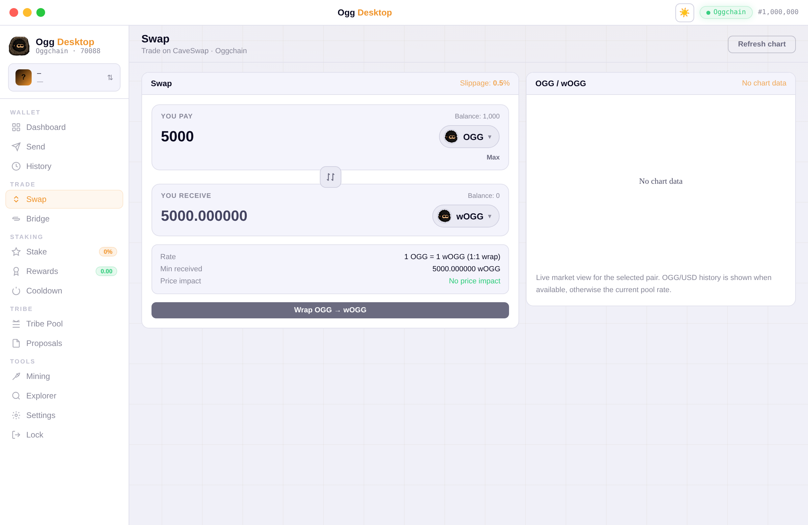
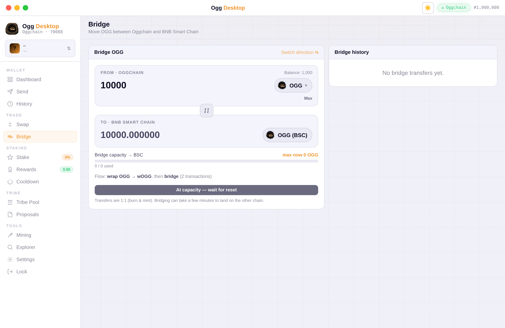
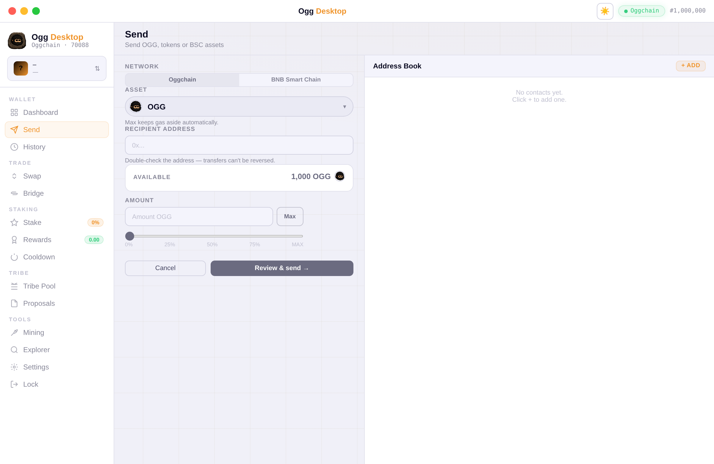
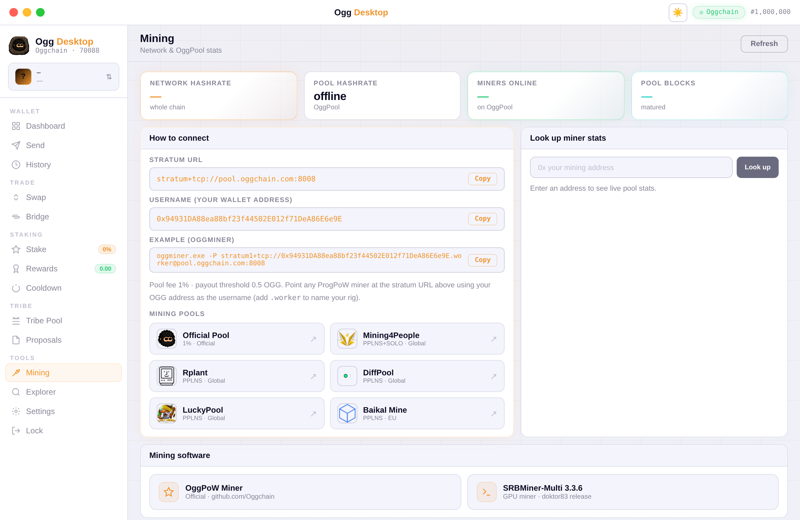

<p align="center">
  
</p>

<h1 align="center">Ogg Desktop</h1>

<p align="center">
  <b>Wallet · Swap · Bridge · Stake · Govern · Mine</b><br/>
  The official self-custody desktop wallet for Oggchain (OGG).
</p>

<p align="center">
  
  
  
  
  
</p>

---

## Overview

**Ogg Desktop** is the official desktop wallet for the **Oggchain** network (Chain ID `70088`). It is fully self-custodial: your private keys are encrypted with your password and stored only on your own machine — they are never transmitted anywhere.

Everything the network offers lives in one clean interface — no browser extensions, no third-party custody, no command line. Hold OGG and tokens across **Oggchain and BNB Smart Chain**, swap on CaveSwap with a live price chart, bridge OGG to and from BSC, stake, vote in Tribe governance, and connect to any mining pool.

<p align="center">
  
</p>

<p align="center">
  
  
</p>

<p align="center">
  
  
</p>

---

## Features

### Multi-chain wallet
- One address across **Oggchain** and **BNB Smart Chain**
- Built-in assets: OGG, wOGG, BNB, OGG (BSC), USDT (BSC)
- Add any custom token on either chain — paste a contract address and its name, symbol and decimals are read directly from the chain
- Network-first send with a percentage slider and a gas-aware **Max** that always reserves the network fee
- Multiple wallets on one machine, each encrypted with its own password

### Swap on CaveSwap
- Swap tokens on Oggchain through the CaveSwap router
- Live quotes, adjustable slippage, minimum-received and price-impact warnings
- OGG ⇄ wOGG 1:1 wrap / unwrap with automatic one-time approvals
- A live price chart of the selected pair beside the swap panel

### OGG ⇄ BSC Bridge
- Move OGG between Oggchain and BNB Smart Chain 1:1 (burn & mint)
- Auto-wrap on the way out, auto-unwrap on arrival
- Live destination-capacity guard — a transfer can never exceed what the destination can mint in the current window
- Persistent bridge history with source and destination explorer links

### Staking & governance
- Stake and unstake OGG, track your position and cooldown, and claim rewards
- Live pool stats and estimated APR
- View the Tribe treasury, read proposals, and vote yes / no on Tribe Pool spending

### Mining
- Network and pool statistics, one-click stratum details, and a miner look-up
- Quick links to every OGG pool — Official, Mining4People, Rplant, DiffPool, LuckyPool and Baikal Mine

### Security & experience
- **Self-custody** — keys are encrypted locally and never leave your device
- A clear confirmation dialog before every send, swap and bridge
- Runs in the system tray, single-instance, frameless native window
- Light and dark themes

---

## Download & install

Grab the latest build for your system from the [Releases](../../releases) page.

| OS | File | How to run |
| --- | --- | --- |
| Windows | `Ogg Desktop Setup <version>.exe` | Double-click and install. Adds Start-menu & desktop shortcuts. |
| macOS | `Ogg Desktop-<version>.dmg` | Open the `.dmg`, drag the app into Applications. |
| Linux | `Ogg Desktop-<version>.AppImage` | `chmod +x` it, then run. No install needed. |

> **Back up your keys.** This is a self-custody wallet. If you lose your password or your device, no one — including the Oggchain team — can recover your wallet. Export and safely store your private key.

---

## Network

| | |
| --- | --- |
| Chain | Oggchain |
| Coin | Oggcoin (OGG) |
| Chain ID | 70088 |
| RPC | https://rpc.oggchain.com |
| Explorer | https://scan.oggchain.com |
| Consensus | ProgPoW (hybrid PoW / PoS) |

### Core contracts

| Contract | Address |
| --- | --- |
| Staking | `0xa47008c59f729756bEc7d01f6FE71328A242d0c4` |
| Tribe Pool | `0x085CF5da09842FA3BA01068CC02c156198b1b114` |
| CaveSwap Router | `0x63bF06B97B6764699715A1421F65F5DBdED54008` |
| CaveSwap Factory | `0xeDD3931022b29F1d2EB226E978A775eE05891866` |
| wOGG | `0x481c52Fc0394943d3A1190e5121F63a67C072ABb` |
| Bridge (Oggchain) | `0x9C86C959dbfD0FFe997fceF3c4b307c1a9AcFc8A` |
| Bridge (BSC) | `0xb448CE16ec19882556Bea1171cA8D02774a5E49E` |
| OGG on BSC | `0xC44Efba271E71351CE20F96cFAc2d1d5c2302Aa3` |

---

## Build from source

Ogg Desktop is built with **Electron** and **ethers.js**. You need Node.js 18 or newer (Node 20 LTS recommended).

```bash
# clone
git clone https://github.com/Oggchain/Ogg-Desktop.git
cd Ogg-Desktop

# install dependencies
npm install

# run in development
npm start
```

### Packaging

Build a distributable for your platform (output lands in `dist/`):

```bash
npm run build:win      # Windows  -> Setup .exe + portable .zip
npm run build:linux    # Linux    -> .AppImage + .zip
npm run build:mac      # macOS    -> .dmg  (must be run on a Mac)
```

macOS builds can only be produced on macOS.

### Project structure

```
Ogg-Desktop/
├── assets/            # app icons, coin & pool logos, installer art
├── src/
│   ├── main.js        # Electron main process (window, tray, RPC bridge)
│   ├── preload.js     # secure bridge to the renderer
│   ├── index.html     # the wallet UI
│   ├── wallet.js      # key generation, encryption, signing helpers
│   └── lib/           # bundled ethers.js
├── package.json       # app + build configuration
└── README.md
```

---

## Security

- **Self-custody.** Private keys are encrypted with your password and stored only on your device. They are never transmitted anywhere.
- **Back up your keys.** If you lose your password or your device, no one can recover your wallet.
- **Verify your download.** Only install builds from the official [Releases](../../releases) page.
- Found a vulnerability? Please report it responsibly rather than opening a public issue.

---

## Contributing

Issues and pull requests are welcome. If you're building on Oggchain or want to improve the wallet, open an issue to start the conversation.

## License

Released under the [MIT License](LICENSE).

---

<p align="center">
  Oggchain · Chain ID 70088
</p>
